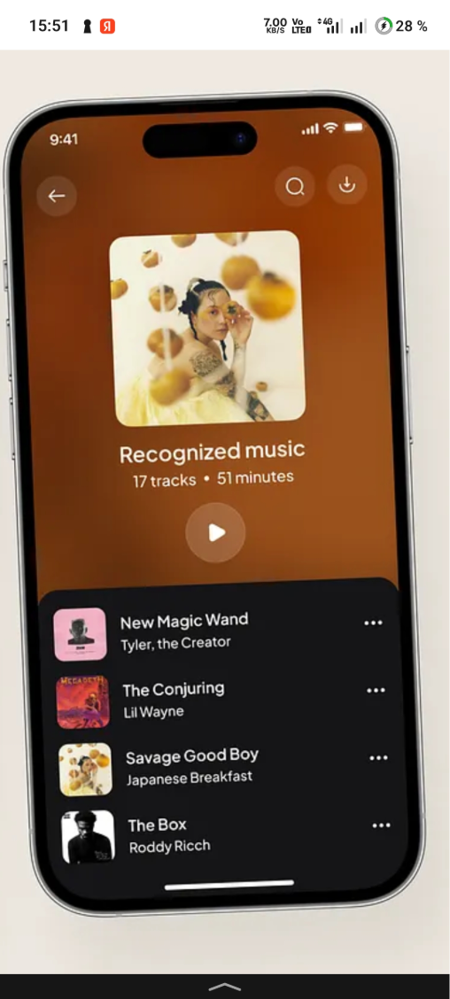

# баги в открытом плейлисте

**ID:** `n5310`  
**Тип:** Баг  
**Категория:** visual (Визуальный)  
**Приоритет:** medium (Средний)  
**Статус:** open (Открыт)  
**Создан:** 20.06.2026, 23:45:32  
**Метки:** android  

## Описание
итак, незнаю как описать.
1. убрать это конченое затемнение фона к низу, а ещё сделай фон плейлиста чтобы автоматически крастат подстраивался под цвета обложек, ну те 4 которые используются.. плавно
2. над этими кнопками тоже нужно поработать, кнопке сделать на фоне, а не на списке.
3. сделай кастомный овкрскролл, тот же самый например что используются для камешков на главной, а не этот андроидовский. на втором скрине кстати референс официальный, глянь какой там фон, там без затемнений.
4. также кнопочек будет всего три: кгопка воспооиведения паузы по центру, проверь, чтобы работало!! кнопка эта без подложки. с лева кнопочка скачивания и с права кнопка перемешать, эти две кнопки с полупрозрачной круглой обложкой..
5. кнопку поиска вверху замени на три точки, без подложки!! а кнопку крестика тоже без подложки на стрелку назад < такую, красивую как в ios

## Скриншоты

